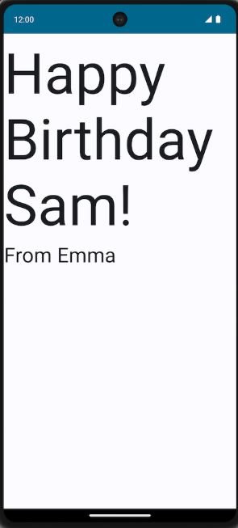

# Лекция 11


### Код программы
```kotlin
package com.example.birthdayapp

import android.os.Bundle
import androidx.activity.ComponentActivity
import androidx.activity.compose.setContent
import androidx.compose.foundation.layout.Arrangement
import androidx.compose.foundation.layout.Column
import androidx.compose.foundation.layout.fillMaxSize
import androidx.compose.foundation.layout.padding
import androidx.compose.material3.MaterialTheme
import androidx.compose.material3.Surface
import androidx.compose.material3.Text
import androidx.compose.runtime.Composable
import androidx.compose.ui.Alignment
import androidx.compose.ui.Modifier
import androidx.compose.ui.graphics.Color
import androidx.compose.ui.text.font.FontFamily
import androidx.compose.ui.text.font.FontStyle
import androidx.compose.ui.text.font.FontWeight
import androidx.compose.ui.text.style.TextAlign
import androidx.compose.ui.tooling.preview.Preview
import androidx.compose.ui.unit.dp
import androidx.compose.ui.unit.sp
import com.example.birthdayapp.ui.theme.BirthdayAppTheme

class MainActivity : ComponentActivity() {
    override fun onCreate(savedInstanceState: Bundle?) {
        super.onCreate(savedInstanceState)
        setContent {
            BirthdayAppTheme {
                Surface(
                    modifier = Modifier.fillMaxSize(),
                    color = Color(0xFFF0F8FF) // Светло-голубой фон
                ) {
                    StylishBirthdayCard()
                }
            }
        }
    }
}

@Composable
fun StylishBirthdayCard() {
    Column(
        modifier = Modifier
            .fillMaxSize()
            .padding(24.dp),
        verticalArrangement = Arrangement.Center,
        horizontalAlignment = Alignment.CenterHorizontally
    ) {
        // Основной текст
        Text(
            text = "Happy Birthday Sam!",
            fontSize = 56.sp,
            fontWeight = FontWeight.ExtraBold,
            color = Color(0xFFE91E63), // Розовый цвет
            fontStyle = FontStyle.Italic,
            textAlign = TextAlign.Center,
            lineHeight = 70.sp,
            modifier = Modifier.padding(bottom = 16.dp)
        )
        
        // Декоративная линия
        Text(
            text = "~ ~ ~ ~ ~ ~ ~ ~ ~ ~",
            fontSize = 24.sp,
            color = Color(0xFF4CAF50), // Зеленый цвет
            modifier = Modifier.padding(vertical = 16.dp)
        )
        
        // Текст подписи
        Text(
            text = "From Emma",
            fontSize = 36.sp,
            fontWeight = FontWeight.SemiBold,
            color = Color(0xFF2196F3), // Синий цвет
            textAlign = TextAlign.Center,
            modifier = Modifier.padding(top = 16.dp)
        )
    }
}

@Preview(showBackground = true, showSystemUi = true)
@Composable
fun StylishBirthdayCardPreview() {
    BirthdayAppTheme {
        StylishBirthdayCard()
    }
}
```
