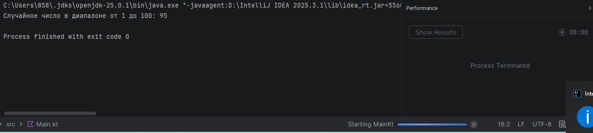

# Практическая работа №1: Основы Kotlin - переменные и функции

## Вариант 15

### Задание
Напишите программу, которая генерирует случайное число в заданном диапазоне.

### Код программы
```kotlin
import kotlin.random.Random

fun main() {
    // Задаем диапазон
    val min = 1
    val max = 100

    // Генерируем случайное число в диапазоне от min до max включительно
    val randomNumber = generateRandomNumber(min, max)

    // Выводим результат
    println("Случайное число в диапазоне от $min до $max: $randomNumber")
}

// Функция для генерации случайного числа в диапазоне
fun generateRandomNumber(min: Int, max: Int): Int {
    return Random.nextInt(from = min, until = max + 1)
}
```
