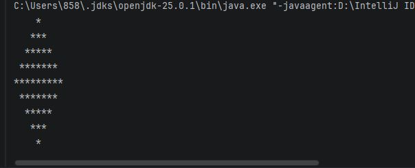

# Практическая работа 3. Циклы

## Вариант 15

### Задание
Вывести ромб из звёздочек высотой 5.
### Код программы
```kotlin
fun main() {
    val height = 5

    // Верхняя часть ромба
    for (i in 1..height) {
        // Выводим пробелы
        for (j in 1..(height - i)) {
            print(" ")
        }
        // Выводим звёздочки
        for (k in 1..(2 * i - 1)) {
            print("*")
        }
        println()
    }

    // Нижняя часть ромба
    for (i in (height - 1) downTo 1) {
        // Пробелы
        for (j in 1..(height - i)) {
            print(" ")
        }
        // Звёздочки
        for (k in 1..(2 * i - 1)) {
            print("*")
        }
        println()
    }
}
}
```
