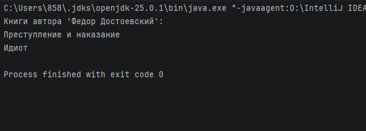

# Практическая работа 4. Работа с коллекциями в Kotlin

## Вариант 15

### Задание

Создайте ассоциативный массив книг (название -> автор). Напишите функцию, которая возвращает список книг заданного автора.
### Код программы
```kotlin
fun main() {
    // Создаем ассоциативный массив: книга → автор
    val books = mapOf(
        "Война и мир" to "Лев Толстой",
        "Анна Каренина" to "Лев Толстой",
        "Преступление и наказание" to "Федор Достоевский",
        "Идиот" to "Федор Достоевский",
        "Мастер и Маргарита" to "Михаил Булгаков",
        "Белая гвардия" to "Михаил Булгаков",
        "Маленький принц" to "Антуан де Сент-Экзюпери"
    )

    // Вызов функции и вывод результата
    val authorToSearch = "Федор Достоевский"
    val booksByAuthor = getBooksByAuthor(books, authorToSearch)

    println("Книги автора '$authorToSearch':")
    for (book in booksByAuthor) {
        println(book)
    }
}

// Функция, возвращающая список книг по автору
fun getBooksByAuthor(books: Map<String, String>, author: String): List<String> {
    val result = mutableListOf<String>()
    for ((title, bookAuthor) in books) {
        if (bookAuthor == author) {
            result.add(title)
        }
    }
    return result
}
```
