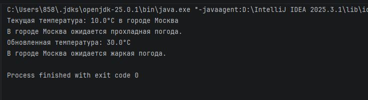

# Практическая работа 5. Классы и объекты
## Вариант 15

### Задание
 Создать класс "Погода" с данными о температуре и методами прогнозирования.
### Код программы
```kotlin
// Класс "Погода" с данными о температуре и методами прогнозирования
class Weather(private var temperature: Double, private var city: String) {

    // Получение текущей температуры
    fun getTemperature(): Double {
        return temperature
    }

    // Установка новой температуры
    fun setTemperature(newTemperature: Double) {
        temperature = newTemperature
    }

    // Получение информации о городе
    fun getCity(): String {
        return city
    }

    // Установка нового города
    fun setCity(newCity: String) {
        city = newCity
    }

    // Метод для прогнозирования погоды на основе текущей температуры
    fun forecast() {
        when {
            temperature < 0 -> println("В городе $city ожидается холодная погода.")
            temperature in 0.0..15.0 -> println("В городе $city ожидается прохладная погода.")
            temperature > 15 && temperature <= 25 -> println("В городе $city ожидается умеренно теплое солнце.")
            temperature > 25 -> println("В городе $city ожидается жаркая погода.")
            else -> println("Нет данных для прогноза.")
        }
    }
}

// Демонстрация использования класса
fun main() {
    val weather = Weather(10.0, "Москва")
    println("Текущая температура: ${weather.getTemperature()}°C в городе ${weather.getCity()}")
    weather.forecast()

    // Обновим температуру
    weather.setTemperature(30.0)
    println("Обновленная температура: ${weather.getTemperature()}°C")
    weather.forecast()
}
```
